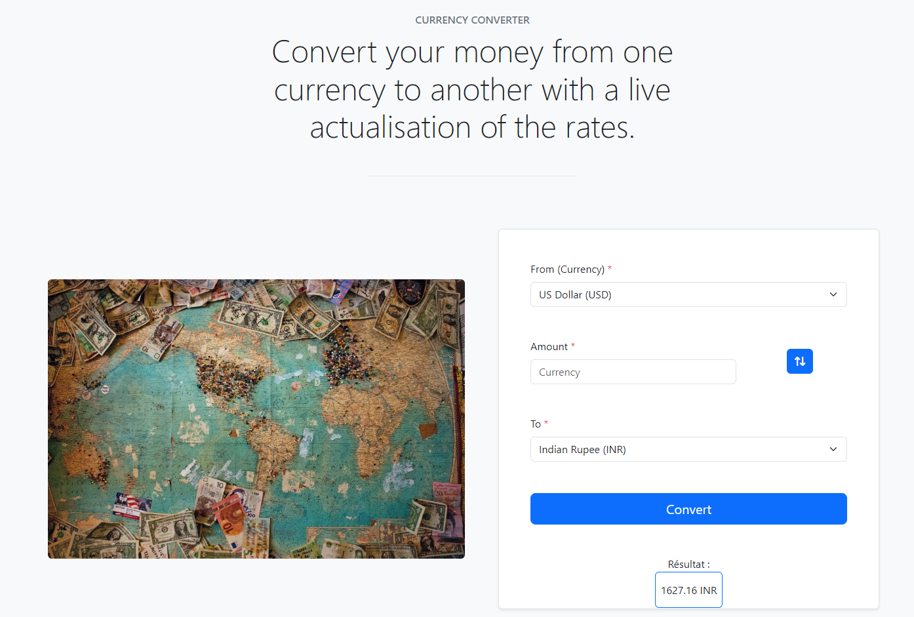

# Currency-Converter

Currency-Converter est un website permettant de calculer la conversion de votre monnaie avec les taux de changes actualisés **en temps réel** à l'aide d'une API.

## Installation

- Clonez le repo
- Lancez un serveur gérant du PhP (MAMP, Laravel...) et ouvrez l'index.php
- Voilà ! 

## Live Version
Le site est disponible à l'adresse suivante : [Currency-Conversion](http://currency-converter.free.nf/)

## Technos
- __Code__ : PhP + cURL, JavaScript, HTML, Bootstrap
- __Deploy__ : infinityfreeapp.com
- __API__ : [Currency Conversion and Exchange Rates](https://rapidapi.com/principalapis/api/currency-conversion-and-exchange-rates/)

## Objectif
Ce projet m'a été demandé dans le cadre de la formation BeCode Bruxelles (Swartz-8, 2023). Il m'était demandé de créer un currency converter utilisant une API. C'est chose faite! 
